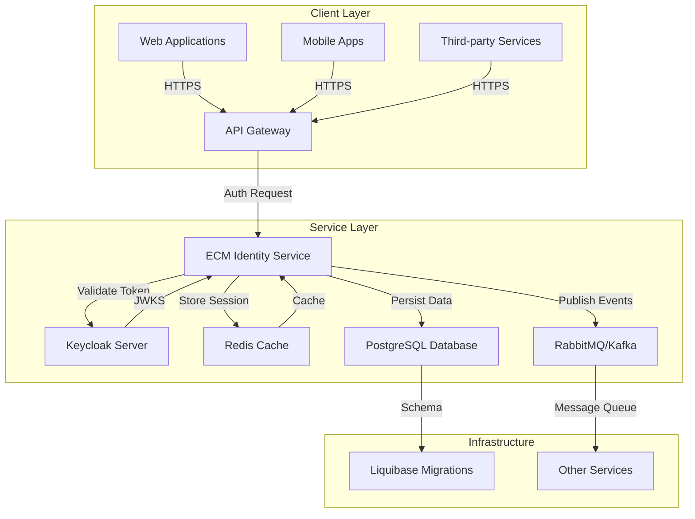

# ECM Identity Service - Architecture

## System Architecture Overview

The ECM Identity Service follows a microservice-based Spring Boot architecture designed for scalability, maintainability, and enterprise-grade security.

### High-Level Architecture Diagram



## Core Components Architecture

### 1. Authentication & Authorization Layer

#### Keycloak Integration
- **OAuth2/OpenID Connect Provider**: Centralized identity management
- **JWT Token Validation**: Stateless authentication with proper signature verification
- **Role-Based Access Control (RBAC)**: Fine-grained permission management
- **Multi-Environment Support**: Separate realms for dev, uat, prod

#### Spring Security Configuration
```java
@KeycloakConfiguration
@EnableGlobalMethodSecurity(prePostEnabled = true, securedEnabled = true, jsr250Enabled = true)
public class SecurityConfig extends KeycloakWebSecurityConfigurerAdapter {
    // HTTP security configuration
    // Role hierarchy setup
    // Custom authorization components
}
```

### 2. Database Architecture

#### Schema Design
- **Multi-Schema Strategy**: Separate schemas per environment (dev_ecm, uat_ecm, prod_ecm)
- **Sample Tables**: Users, Roles, User-Roles junction table
- **Audit Fields**: Created/updated timestamps and user tracking
- **Index Strategy**: Performance optimization for authentication queries

#### Liquibase Migration Strategy
- **Timestamp-Based Organization**: YYYYMMDDHHMMSS format for chronological ordering
- **Environment-Specific Data**: Separate data seeding per environment
- **Cross-Database Compatibility**: SQL syntax designed for multiple database systems
- **Rollback Support**: Full rollback capabilities for safe deployments

### 3. Application Architecture

#### Package Structure
```
src/main/java/com/ecm/security/identity/
├── EcmIdentityServiceApplication.java    # Main Spring Boot application
├── config/                              # Configuration classes
│   ├── SecurityConfig.java             # Spring Security setup
│   ├── DatabaseConfig.java             # Database configuration
│   └── LiquibaseConfig.java            # Liquibase configuration
├── controller/                          # REST API endpoints
├── service/                             # Business logic
├── repository/                          # Data access layer
├── model/                               # JPA entities
└── util/                                # Utility classes
```

#### Spring Boot Configuration
- **Profile-Based Configuration**: Environment-specific application properties
- **Externalized Configuration**: Environment variables for sensitive data
- **Health Checks**: Actuator endpoints for monitoring
- **Logging Configuration**: Structured logging with appropriate levels

### 4. Infrastructure Architecture

#### Docker Containerization
```yaml
services:
  app:
    image: ecm-identity-service:latest
    environment:
      - SPRING_PROFILES_ACTIVE=dev
      - DB_URL=jdbc:postgresql://postgres:5432/ecm_identity_dev
    depends_on:
      - postgres
      - redis
      - keycloak
  postgres:
    image: postgres:18-alpine
    environment:
      POSTGRES_DB: ecm_identity_dev
      POSTGRES_USER: dev_ecm
      POSTGRES_PASSWORD: dev_ecm!23456
  redis:
    image: redis:7-alpine
  keycloak:
    image: quay.io/keycloak/keycloak:24.0.2
```

#### Messaging Architecture
- **RabbitMQ**: AMQP messaging for service communication
- **Kafka**: Event streaming for data pipelines
- **Redis**: Caching and session management
- **Message Patterns**: Event-driven architecture for loose coupling

## Data Flow Architecture

### Authentication Flow
1. **Client Request**: Application sends authentication request to Keycloak
2. **Token Generation**: Keycloak validates credentials and issues JWT
3. **Token Validation**: Service validates JWT signature and claims
4. **Session Management**: Redis stores session state for performance
5. **Authorization Check**: Role-based access control enforcement

### Database Migration Flow
1. **Change Creation**: Developer creates timestamped changelog file
2. **Validation**: Liquibase validates changelog syntax
3. **Execution**: Changes applied to target environment
4. **Rollback**: Automatic rollback capabilities for failed deployments

### API Request Flow
1. **Request Reception**: API Gateway routes request to service
2. **Authentication**: JWT token validation
3. **Authorization**: Role-based permission check
4. **Business Logic**: Service processes request
5. **Response**: Returns result to client

## Integration Patterns

### Service-to-Service Communication
- **REST APIs**: Synchronous communication for immediate responses
- **Message Queues**: Asynchronous communication for decoupled processing
- **Event Streaming**: Real-time data flow for reactive systems

### External System Integration
- **Keycloak**: Identity provider integration
- **Database**: PostgreSQL with connection pooling
- **Monitoring**: Integration with observability tools
- **CI/CD**: Automated deployment pipeline integration

## Security Architecture

### Authentication Security
- **JWT Token Security**: Proper signature validation and expiration handling
- **HTTPS Enforcement**: TLS/SSL for all communications
- **Token Refresh**: Automatic token refresh mechanisms
- **Session Security**: Secure session management with Redis

### Authorization Security
- **Role Hierarchy**: Hierarchical role-based access control
- **Method-Level Security**: Fine-grained permission checking
- **Resource-Based Authorization**: Object-level permission control
- **Audit Logging**: Comprehensive security event logging

### Data Security
- **Database Encryption**: Encrypted connections and data at rest
- **Secrets Management**: Secure handling of credentials and keys
- **Input Validation**: Protection against injection attacks
- **Access Control**: Database-level access restrictions

## Deployment Architecture

### Environment Strategy
- **Local Development**: Docker Compose with all dependencies
- **Development Server**: Shared development environment
- **UAT Environment**: User acceptance testing environment
- **Production Environment**: High-availability production setup

### Scaling Strategy
- **Horizontal Scaling**: Multiple service instances behind load balancer
- **Database Scaling**: Connection pooling and read replicas
- **Cache Scaling**: Redis cluster for distributed caching
- **Message Queue Scaling**: Clustered RabbitMQ/Kafka for high throughput

## Monitoring and Observability

### Health Checks
- **Application Health**: Spring Boot Actuator endpoints
- **Database Health**: Connection and query performance monitoring
- **External Service Health**: Keycloak and message queue monitoring

### Metrics Collection
- **Performance Metrics**: Response times and throughput
- **Security Metrics**: Authentication success/failure rates
- **Resource Metrics**: Memory, CPU, and database usage
- **Business Metrics**: User activity and feature usage

### Logging Strategy
- **Structured Logging**: JSON format for machine parsing
- **Log Levels**: Appropriate levels for different environments
- **Log Aggregation**: Centralized logging for analysis
- **Security Logging**: Audit trails for compliance

This architecture provides a solid foundation for a scalable, secure, and maintainable identity service that can grow with the organization's needs while maintaining high availability and performance standards.