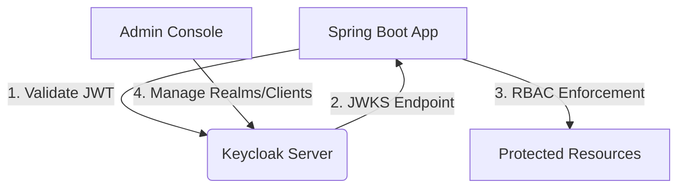

# Keycloak Authentication Implementation Guide

## Overview
This document details the implementation of Keycloak-based authentication and authorization for the ECM Identity Service. The solution provides:
- Centralized identity management
- OAuth2/OpenID Connect compliance
- Role-based access control (RBAC)
- Environment-specific configurations

## Architecture


## Implementation Components

### 1. Keycloak Docker Setup
Added to `docker-compose.yml`:
```yaml
keycloak:
  image: quay.io/keycloak/keycloak:24.0.2
  container_name: ecm-identity-keycloak
  environment:
    KC_DB: postgres
    KC_DB_URL: jdbc:postgresql://postgres:5432/ecm_identity_dev
    KC_DB_USERNAME: dev_ecm
    KC_DB_PASSWORD: dev_ecm!23456
    KEYCLOAK_ADMIN: admin
    KEYCLOAK_ADMIN_PASSWORD: admin
    KC_HOSTNAME: localhost
    KC_HTTP_PORT: 8080
    KC_PROXY: edge
  ports:
    - "8080:8080"
  depends_on:
    postgres:
      condition: service_healthy
  command: ["start-dev"]
```

### 2. Spring Boot Dependencies
Added to `build.gradle`:
```gradle
implementation 'org.keycloak:keycloak-spring-boot-starter:24.0.2'
```

### 3. Security Configuration and Authorization

#### 3.1 HTTP Security Configuration
`SecurityConfig.java`:
```java
@KeycloakConfiguration
@EnableGlobalMethodSecurity(prePostEnabled = true, securedEnabled = true, jsr250Enabled = true)
public class SecurityConfig extends KeycloakWebSecurityConfigurerAdapter {

    @Autowired
    public void configureGlobal(AuthenticationManagerBuilder auth) {
        KeycloakAuthenticationProvider provider = keycloakAuthenticationProvider();
        provider.setGrantedAuthoritiesMapper(new SimpleAuthorityMapper());
        auth.authenticationProvider(provider);
    }

    @Bean
    @Override
    protected SessionAuthenticationStrategy sessionAuthenticationStrategy() {
        return new RegisterSessionAuthenticationStrategy(new SessionRegistryImpl());
    }

    @Override
    protected void configure(HttpSecurity http) throws Exception {
        super.configure(http);
        http
            .authorizeRequests()
                .antMatchers("/actuator/health").permitAll()
                .antMatchers("/api/admin/**").hasRole("ADMIN")
                .antMatchers("/api/users/**").access("@userAccessControl.checkUserId(authentication,#userId)")
                .antMatchers("/api/**").authenticated()
                .anyRequest().permitAll()
            .and()
            .csrf().disable();
    }
}

// Custom authorization component
@Component
public class UserAccessControl {
    public boolean checkUserId(Authentication authentication, String userId) {
        KeycloakAuthenticationToken token = (KeycloakAuthenticationToken) authentication;
        return token.getName().equals(userId) ||
               token.getAuthorities().stream()
                    .anyMatch(a -> a.getAuthority().equals("ROLE_ADMIN"));
    }
}
```

#### 3.2 JPA/Hibernate Model Configuration
For proper RBAC integration, configure your entities to map Keycloak roles:

```java
@Entity
@Table(name = "users")
public class User {
    @Id
    private String id; // Matches Keycloak user ID
    
    private String username;
    private String email;
    
    @ElementCollection(fetch = FetchType.EAGER)
    @CollectionTable(name = "user_roles", joinColumns = @JoinColumn(name = "user_id"))
    @Column(name = "role")
    private Set<String> roles = new HashSet<>();
    
    // Getters and setters
}
```

Spring Data JPA Repository:
```java
public interface UserRepository extends JpaRepository<User, String> {
    Optional<User> findByUsername(String username);
}
```

#### 3.3 Method-Level Authorization
```java
@Service
public class DocumentService {
    
    @PreAuthorize("hasRole('DOCUMENT_EDITOR') or hasRole('ADMIN')")
    public Document updateDocument(Document document) {
        // Only users with DOCUMENT_EDITOR or ADMIN role can update documents
    }
    
    @PreAuthorize("#userId == authentication.name or hasRole('ADMIN')")
    public List<Document> getUserDocuments(String userId) {
        // Users can access their own documents or admins can access any
    }
}
```

#### 3.4 Role Hierarchy Configuration
```java
@Bean
public RoleHierarchy roleHierarchy() {
    RoleHierarchyImpl hierarchy = new RoleHierarchyImpl();
    hierarchy.setHierarchy(
        "ROLE_ADMIN > ROLE_MANAGER\n" +
        "ROLE_MANAGER > ROLE_USER\n" +
        "ROLE_USER > ROLE_GUEST"
    );
    return hierarchy;
}

// Update SecurityConfig to use hierarchy
@Autowired
private RoleHierarchy roleHierarchy;

@Override
protected void configure(HttpSecurity http) throws Exception {
    http
        // ... existing configuration ...
        .expressionHandler(webExpressionHandler());
}

private SecurityExpressionHandler<FilterInvocation> webExpressionHandler() {
    DefaultWebSecurityExpressionHandler handler = new DefaultWebSecurityExpressionHandler();
    handler.setRoleHierarchy(roleHierarchy);
    return handler;
}
```

#### 3.5 Resource-Based Authorization
```java
@Configuration
@EnableGlobalMethodSecurity(prePostEnabled = true)
public class MethodSecurityConfig extends GlobalMethodSecurityConfiguration {
    
    @Override
    protected MethodSecurityExpressionHandler createExpressionHandler() {
        DefaultMethodSecurityExpressionHandler handler =
            new DefaultMethodSecurityExpressionHandler();
        handler.setPermissionEvaluator(new DocumentPermissionEvaluator());
        return handler;
    }
}

@Component
public class DocumentPermissionEvaluator implements PermissionEvaluator {
    
    @Autowired
    private DocumentRepository documentRepository;

    @Override
    public boolean hasPermission(Authentication auth, Object targetId,
                                Object permission) {
        String username = auth.getName();
        Document document = documentRepository.findById((Long)targetId).orElseThrow();
        
        // Check if user is owner or has required permission
        return document.getOwner().equals(username) ||
               document.getEditors().contains(username);
    }
}

// Usage in service
@Service
public class DocumentService {
    @PreAuthorize("hasPermission(#id, 'document', 'edit')")
    public Document updateDocument(Long id, Document updates) {
        // Only users with edit permission can update
    }
}
```
`SecurityConfig.java`:
```java
@KeycloakConfiguration
@EnableGlobalMethodSecurity(prePostEnabled = true, securedEnabled = true, jsr250Enabled = true)
public class SecurityConfig extends KeycloakWebSecurityConfigurerAdapter {

    @Autowired
    public void configureGlobal(AuthenticationManagerBuilder auth) {
        KeycloakAuthenticationProvider provider = keycloakAuthenticationProvider();
        provider.setGrantedAuthoritiesMapper(new SimpleAuthorityMapper());
        auth.authenticationProvider(provider);
    }

    @Bean
    @Override
    protected SessionAuthenticationStrategy sessionAuthenticationStrategy() {
        return new RegisterSessionAuthenticationStrategy(new SessionRegistryImpl());
    }

    @Override
    protected void configure(HttpSecurity http) throws Exception {
        super.configure(http);
        http
            .authorizeRequests()
                .antMatchers("/actuator/health").permitAll()
                .antMatchers("/api/admin/**").hasRole("ADMIN")
                .antMatchers("/api/users/**").access("@userAccessControl.checkUserId(authentication,#userId)")
                .antMatchers("/api/**").authenticated()
                .anyRequest().permitAll()
            .and()
            .csrf().disable();
    }
}

// Custom authorization component
@Component
public class UserAccessControl {
    public boolean checkUserId(Authentication authentication, String userId) {
        KeycloakAuthenticationToken token = (KeycloakAuthenticationToken) authentication;
        return token.getName().equals(userId) ||
               token.getAuthorities().stream()
                    .anyMatch(a -> a.getAuthority().equals("ROLE_ADMIN"));
    }
}
```

### 4. JPA/Hibernate Model Configuration
For proper RBAC integration, configure your entities to map Keycloak roles:

```java
@Entity
@Table(name = "users")
public class User {
    @Id
    private String id; // Matches Keycloak user ID
    
    private String username;
    private String email;
    
    @ElementCollection(fetch = FetchType.EAGER)
    @CollectionTable(name = "user_roles", joinColumns = @JoinColumn(name = "user_id"))
    @Column(name = "role")
    private Set<String> roles = new HashSet<>();
    
    // Getters and setters
}
```

Spring Data JPA Repository:
```java
public interface UserRepository extends JpaRepository<User, String> {
    Optional<User> findByUsername(String username);
}
```

### 5. Environment Configuration
Added to environment-specific properties files (e.g. `application-dev.properties`):
```properties
# Keycloak Configuration
keycloak.realm=ecm-identity
keycloak.auth-server-url=${KEYCLOAK_URL:http://dev-server:8080}
keycloak.ssl-required=external
keycloak.resource=ecm-identity-backend
keycloak.credentials.secret=${KEYCLOAK_CLIENT_SECRET}
keycloak.public-client=false
keycloak.use-resource-role-mappings=true

# JPA Configuration
spring.jpa.properties.hibernate.jdbc.lob.non_contextual_creation=true
spring.jpa.hibernate.ddl-auto=validate
```

### 6. Realm/Client Setup Script
`scripts/keycloak-setup.sh` automates:
- Realm creation
- Client configuration
- Role creation (ADMIN, USER)
- Test user creation

## Testing Strategy

### Unit Tests
- Verify security configuration
- Test role-based access control
- Validate JWT parsing logic

### Integration Tests
```java
@SpringBootTest
@AutoConfigureMockMvc
class SecurityIntegrationTests {

    @Autowired
    private MockMvc mockMvc;

    @Test
    void unauthenticatedAccessToProtectedEndpointShouldFail() throws Exception {
        mockMvc.perform(get("/api/users"))
            .andExpect(status().isUnauthorized());
    }

    @Test
    void adminRoleAccessToAdminEndpoint() throws Exception {
        String token = obtainAccessToken("admin", "admin");
        
        mockMvc.perform(get("/api/admin")
                .header("Authorization", "Bearer " + token))
            .andExpect(status().isOk());
    }
}
```

## Security Considerations
1. Use HTTPS in production environments
2. Rotate client secrets regularly
3. Set appropriate token lifespans
4. Enable Keycloak security defenses (brute-force protection)
5. Regularly audit roles and permissions

## Troubleshooting Guide

| Issue | Solution |
|-------|----------|
| Authentication failures | Verify Keycloak server availability and realm configuration |
| Role mapping issues | Check realm roles and client scopes in Keycloak |
| Token validation errors | Confirm JWT issuer and audience match client config |
| CORS errors | Configure proper allowed origins in Keycloak client |

## Maintenance Procedures
1. Keycloak version upgrades
2. Regular backup of realm configurations
3. Monitoring of authentication logs
4. Periodic review of role assignments

## Dependencies
- Keycloak Spring Boot Adapter
- Spring Security
- Lombok (for cleaner code)
- JUnit 5 for testing