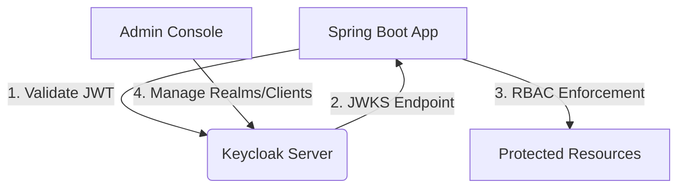

# Keycloak Authentication Implementation Guide

## Overview
This document details the implementation of Keycloak-based authentication and authorization for the ECM Identity Service. The solution provides:
- Centralized identity management
- OAuth2/OpenID Connect compliance
- Role-based access control (RBAC)
- Environment-specific configurations

## Architecture


## Implementation Components

### 1. Keycloak Docker Setup
Added to `docker-compose.yml`:
```yaml
keycloak:
  image: quay.io/keycloak/keycloak:24.0.2
  container_name: ecm-identity-keycloak
  environment:
    KC_DB: postgres
    KC_DB_URL: jdbc:postgresql://postgres:5432/ecm_identity_dev
    KC_DB_USERNAME: dev_ecm
    KC_DB_PASSWORD: dev_ecm!23456
    KEYCLOAK_ADMIN: admin
    KEYCLOAK_ADMIN_PASSWORD: admin
    KC_HOSTNAME: localhost
    KC_HTTP_PORT: 8080
    KC_PROXY: edge
  ports:
    - "8080:8080"
  depends_on:
    postgres:
      condition: service_healthy
  command: ["start-dev"]
```

### 2. Spring Boot Dependencies
Added to `build.gradle`:
```gradle
implementation 'org.keycloak:keycloak-spring-boot-starter:24.0.2'
```

### 3. Security Configuration and Authorization

#### 3.1 HTTP Security Configuration
`SecurityConfig.java`:
```java
@KeycloakConfiguration
@EnableGlobalMethodSecurity(prePostEnabled = true, securedEnabled = true, jsr250Enabled = true)
public class SecurityConfig extends KeycloakWebSecurityConfigurerAdapter {

    @Autowired
    public void configureGlobal(AuthenticationManagerBuilder auth) {
        KeycloakAuthenticationProvider provider = keycloakAuthenticationProvider();
        provider.setGrantedAuthoritiesMapper(new SimpleAuthorityMapper());
        auth.authenticationProvider(provider);
    }

    @Bean
    @Override
    protected SessionAuthenticationStrategy sessionAuthenticationStrategy() {
        return new RegisterSessionAuthenticationStrategy(new SessionRegistryImpl());
    }

    @Override
    protected void configure(HttpSecurity http) throws Exception {
        super.configure(http);
        http
            .authorizeRequests()
                .antMatchers("/actuator/health").permitAll()
                .antMatchers("/api/admin/**").hasRole("ADMIN")
                .antMatchers("/api/users/**").access("@userAccessControl.checkUserId(authentication,#userId)")
                .antMatchers("/api/**").authenticated()
                .anyRequest().permitAll()
            .and()
            .csrf().disable();
    }
}

// Custom authorization component
@Component
public class UserAccessControl {
    public boolean checkUserId(Authentication authentication, String userId) {
        KeycloakAuthenticationToken token = (KeycloakAuthenticationToken) authentication;
        return token.getName().equals(userId) ||
               token.getAuthorities().stream()
                    .anyMatch(a -> a.getAuthority().equals("ROLE_ADMIN"));
    }
}
```

#### 3.2 JPA/Hibernate Model Configuration
For proper RBAC integration, configure your entities to map Keycloak roles:

```java
@Entity
@Table(name = "users")
public class User {
    @Id
    private String id; // Matches Keycloak user ID
    
    private String username;
    private String email;
    
    @ElementCollection(fetch = FetchType.EAGER)
    @CollectionTable(name = "user_roles", joinColumns = @JoinColumn(name = "user_id"))
    @Column(name = "role")
    private Set<String> roles = new HashSet<>();
    
    // Getters and setters
}
```

Spring Data JPA Repository:
```java
public interface UserRepository extends JpaRepository<User, String> {
    Optional<User> findByUsername(String username);
}
```

#### 3.3 Method-Level Authorization
```java
@Service
public class DocumentService {
    
    @PreAuthorize("hasRole('DOCUMENT_EDITOR') or hasRole('ADMIN')")
    public Document updateDocument(Document document) {
        // Only users with DOCUMENT_EDITOR or ADMIN role can update documents
    }
    
    @PreAuthorize("#userId == authentication.name or hasRole('ADMIN')")
    public List<Document> getUserDocuments(String userId) {
        // Users can access their own documents or admins can access any
    }
}
```

#### 3.4 Role Hierarchy Configuration
```java
@Bean
public RoleHierarchy roleHierarchy() {
    RoleHierarchyImpl hierarchy = new RoleHierarchyImpl();
    hierarchy.setHierarchy(
        "ROLE_ADMIN > ROLE_MANAGER\n" +
        "ROLE_MANAGER > ROLE_USER\n" +
        "ROLE_USER > ROLE_GUEST"
    );
    return hierarchy;
}

// Update SecurityConfig to use hierarchy
@Autowired
private RoleHierarchy roleHierarchy;

@Override
protected void configure(HttpSecurity http) throws Exception {
    http
        // ... existing configuration ...
        .expressionHandler(webExpressionHandler());
}

private SecurityExpressionHandler<FilterInvocation> webExpressionHandler() {
    DefaultWebSecurityExpressionHandler handler = new DefaultWebSecurityExpressionHandler();
    handler.setRoleHierarchy(roleHierarchy);
    return handler;
}
```

#### 3.5 Resource-Based Authorization
```java
@Configuration
@EnableGlobalMethodSecurity(prePostEnabled = true)
public class MethodSecurityConfig extends GlobalMethodSecurityConfiguration {
    
    @Override
    protected MethodSecurityExpressionHandler createExpressionHandler() {
        DefaultMethodSecurityExpressionHandler handler =
            new DefaultMethodSecurityExpressionHandler();
        handler.setPermissionEvaluator(new DocumentPermissionEvaluator());
        return handler;
    }
}

@Component
public class DocumentPermissionEvaluator implements PermissionEvaluator {
    
    @Autowired
    private DocumentRepository documentRepository;

    @Override
    public boolean hasPermission(Authentication auth, Object targetId,
                                Object permission) {
        String username = auth.getName();
        Document document = documentRepository.findById((Long)targetId).orElseThrow();
        
        // Check if user is owner or has required permission
        return document.getOwner().equals(username) ||
               document.getEditors().contains(username);
    }
}

// Usage in service
@Service
public class DocumentService {
    @PreAuthorize("hasPermission(#id, 'document', 'edit')")
    public Document updateDocument(Long id, Document updates) {
        // Only users with edit permission can update
    }
}
```
`SecurityConfig.java`:
```java
@KeycloakConfiguration
@EnableGlobalMethodSecurity(prePostEnabled = true, securedEnabled = true, jsr250Enabled = true)
public class SecurityConfig extends KeycloakWebSecurityConfigurerAdapter {

    @Autowired
    public void configureGlobal(AuthenticationManagerBuilder auth) {
        KeycloakAuthenticationProvider provider = keycloakAuthenticationProvider();
        provider.setGrantedAuthoritiesMapper(new SimpleAuthorityMapper());
        auth.authenticationProvider(provider);
    }

    @Bean
    @Override
    protected SessionAuthenticationStrategy sessionAuthenticationStrategy() {
        return new RegisterSessionAuthenticationStrategy(new SessionRegistryImpl());
    }

    @Override
    protected void configure(HttpSecurity http) throws Exception {
        super.configure(http);
        http
            .authorizeRequests()
                .antMatchers("/actuator/health").permitAll()
                .antMatchers("/api/admin/**").hasRole("ADMIN")
                .antMatchers("/api/users/**").access("@userAccessControl.checkUserId(authentication,#userId)")
                .antMatchers("/api/**").authenticated()
                .anyRequest().permitAll()
            .and()
            .csrf().disable();
    }
}

// Custom authorization component
@Component
public class UserAccessControl {
    public boolean checkUserId(Authentication authentication, String userId) {
        KeycloakAuthenticationToken token = (KeycloakAuthenticationToken) authentication;
        return token.getName().equals(userId) ||
               token.getAuthorities().stream()
                    .anyMatch(a -> a.getAuthority().equals("ROLE_ADMIN"));
    }
}
```

### 4. JPA/Hibernate Model Configuration
For proper RBAC integration, configure your entities to map Keycloak roles:

```java
@Entity
@Table(name = "users")
public class User {
    @Id
    private String id; // Matches Keycloak user ID
    
    private String username;
    private String email;
    
    @ElementCollection(fetch = FetchType.EAGER)
    @CollectionTable(name = "user_roles", joinColumns = @JoinColumn(name = "user_id"))
    @Column(name = "role")
    private Set<String> roles = new HashSet<>();
    
    // Getters and setters
}
```

Spring Data JPA Repository:
```java
public interface UserRepository extends JpaRepository<User, String> {
    Optional<User> findByUsername(String username);
}
```

### 5. Environment Configuration
Added to environment-specific properties files (e.g. `application-dev.properties`):
```properties
# Keycloak Configuration
keycloak.realm=ecm-identity
keycloak.auth-server-url=${KEYCLOAK_URL:http://dev-server:8080}
keycloak.ssl-required=external
keycloak.resource=ecm-identity-backend
keycloak.credentials.secret=${KEYCLOAK_CLIENT_SECRET}
keycloak.public-client=false
keycloak.use-resource-role-mappings=true

# JPA Configuration
spring.jpa.properties.hibernate.jdbc.lob.non_contextual_creation=true
spring.jpa.hibernate.ddl-auto=validate
```

### 6. Realm/Client Setup Script
`scripts/keycloak-setup.sh` automates:
- Realm creation
- Client configuration
- Role creation (ADMIN, USER)
- Test user creation

## Testing Strategy

### Unit Tests
- Verify security configuration
- Test role-based access control
- Validate JWT parsing logic

### Integration Tests
```java
@SpringBootTest
@AutoConfigureMockMvc
class SecurityIntegrationTests {

    @Autowired
    private MockMvc mockMvc;

    @Test
    void unauthenticatedAccessToProtectedEndpointShouldFail() throws Exception {
        mockMvc.perform(get("/api/users"))
            .andExpect(status().isUnauthorized());
    }

    @Test
    void adminRoleAccessToAdminEndpoint() throws Exception {
        String token = obtainAccessToken("admin", "admin");
        
        mockMvc.perform(get("/api/admin")
                .header("Authorization", "Bearer " + token))
            .andExpect(status().isOk());
    }
}
```

## Security Considerations
1. Use HTTPS in production environments
2. Rotate client secrets regularly
3. Set appropriate token lifespans
4. Enable Keycloak security defenses (brute-force protection)
5. Regularly audit roles and permissions

## Troubleshooting Guide

| Issue | Solution |
|-------|----------|
| Authentication failures | Verify Keycloak server availability and realm configuration |
| Role mapping issues | Check realm roles and client scopes in Keycloak |
| Token validation errors | Confirm JWT issuer and audience match client config |
| CORS errors | Configure proper allowed origins in Keycloak client |

## Maintenance Procedures
1. Keycloak version upgrades
2. Regular backup of realm configurations
3. Monitoring of authentication logs
4. Periodic review of role assignments

## Dependencies
- Keycloak Spring Boot Adapter
- Spring Security
- Lombok (for cleaner code)
- JUnit 5 for testing

## Required Models for Keycloak Integration

### 1. JPA Entity Models

#### 1.1 User Entity (Enhanced for Keycloak Integration)
**Location**: `src/main/java/com/ecm/security/identity/model/entity/User.java`

```java
package com.ecm.security.identity.model.entity;

import jakarta.persistence.*;
import lombok.*;
import java.time.LocalDateTime;
import java.util.HashSet;
import java.util.Set;

@Entity
@Table(name = "users", schema = "dev_ecm")
@Data
@Builder
@NoArgsConstructor
@AllArgsConstructor
@EqualsAndHashCode(of = "id")
public class User {
    
    @Id
    @Column(name = "id", length = 36)
    private String id; // Matches Keycloak user ID (UUID format)
    
    @Column(name = "username", unique = true, nullable = false)
    private String username;
    
    @Column(name = "email", unique = true, nullable = false)
    private String email;
    
    @Column(name = "first_name")
    private String firstName;
    
    @Column(name = "last_name")
    private String lastName;
    
    @Column(name = "enabled")
    private Boolean enabled = true;
    
    @Column(name = "account_locked")
    private Boolean accountLocked = false;
    
    @Column(name = "account_expired")
    private Boolean accountExpired = false;
    
    @Column(name = "credentials_expired")
    private Boolean credentialsExpired = false;
    
    @Column(name = "keycloak_sub")
    private String keycloakSub; // Keycloak subject identifier
    
    @Column(name = "keycloak_email_verified")
    private Boolean keycloakEmailVerified = false;
    
    @Column(name = "created_at")
    private LocalDateTime createdAt;
    
    @Column(name = "updated_at")
    private LocalDateTime updatedAt;
    
    @Column(name = "created_by")
    private String createdBy;
    
    @Column(name = "updated_by")
    private String updatedBy;
    
    @ManyToMany(fetch = FetchType.EAGER)
    @JoinTable(
        name = "user_roles",
        schema = "dev_ecm",
        joinColumns = @JoinColumn(name = "user_id"),
        inverseJoinColumns = @JoinColumn(name = "role_id")
    )
    private Set<Role> roles = new HashSet<>();
    
    @PrePersist
    protected void onCreate() {
        createdAt = LocalDateTime.now();
        updatedAt = LocalDateTime.now();
    }
    
    @PreUpdate
    protected void onUpdate() {
        updatedAt = LocalDateTime.now();
    }
}
```

#### 1.2 Role Entity (Enhanced for Keycloak Integration)
**Location**: `src/main/java/com/ecm/security/identity/model/entity/Role.java`

```java
package com.ecm.security.identity.model.entity;

import jakarta.persistence.*;
import lombok.*;
import java.time.LocalDateTime;
import java.util.HashSet;
import java.util.Set;

@Entity
@Table(name = "roles", schema = "dev_ecm")
@Data
@Builder
@NoArgsConstructor
@AllArgsConstructor
@EqualsAndHashCode(of = "id")
public class Role {
    
    @Id
    @GeneratedValue(strategy = GenerationType.IDENTITY)
    @Column(name = "id")
    private Long id;
    
    @Column(name = "name", unique = true, nullable = false)
    private String name; // e.g., "ADMIN", "USER", "MANAGER"
    
    @Column(name = "description")
    private String description;
    
    @Column(name = "keycloak_role_name")
    private String keycloakRoleName; // Maps to Keycloak role name
    
    @Column(name = "is_system_role")
    private Boolean isSystemRole = false; // Prevent deletion of system roles
    
    @Column(name = "created_at")
    private LocalDateTime createdAt;
    
    @Column(name = "updated_at")
    private LocalDateTime updatedAt;
    
    @Column(name = "created_by")
    private String createdBy;
    
    @Column(name = "updated_by")
    private String updatedBy;
    
    @ManyToMany(mappedBy = "roles")
    private Set<User> users = new HashSet<>();
    
    @PrePersist
    protected void onCreate() {
        createdAt = LocalDateTime.now();
        updatedAt = LocalDateTime.now();
    }
    
    @PreUpdate
    protected void onUpdate() {
        updatedAt = LocalDateTime.now();
    }
}
```

#### 1.3 Permission Entity (For Fine-Grained Authorization)
**Location**: `src/main/java/com/ecm/security/identity/model/entity/Permission.java`

```java
package com.ecm.security.identity.model.entity;

import jakarta.persistence.*;
import lombok.*;
import java.time.LocalDateTime;
import java.util.HashSet;
import java.util.Set;

@Entity
@Table(name = "permissions", schema = "dev_ecm")
@Data
@Builder
@NoArgsConstructor
@AllArgsConstructor
@EqualsAndHashCode(of = "id")
public class Permission {
    
    @Id
    @GeneratedValue(strategy = GenerationType.IDENTITY)
    @Column(name = "id")
    private Long id;
    
    @Column(name = "name", unique = true, nullable = false)
    private String name; // e.g., "document:read", "document:write", "user:manage"
    
    @Column(name = "description")
    private String description;
    
    @Column(name = "resource_type")
    private String resourceType; // e.g., "document", "user", "system"
    
    @Column(name = "action")
    private String action; // e.g., "read", "write", "delete", "manage"
    
    @Column(name = "keycloak_permission_name")
    private String keycloakPermissionName; // Maps to Keycloak permission
    
    @Column(name = "created_at")
    private LocalDateTime createdAt;
    
    @Column(name = "updated_at")
    private LocalDateTime updatedAt;
    
    @Column(name = "created_by")
    private String createdBy;
    
    @Column(name = "updated_by")
    private String updatedBy;
    
    @ManyToMany
    @JoinTable(
        name = "role_permissions",
        schema = "dev_ecm",
        joinColumns = @JoinColumn(name = "permission_id"),
        inverseJoinColumns = @JoinColumn(name = "role_id")
    )
    private Set<Role> roles = new HashSet<>();
    
    @PrePersist
    protected void onCreate() {
        createdAt = LocalDateTime.now();
        updatedAt = LocalDateTime.now();
    }
    
    @PreUpdate
    protected void onUpdate() {
        updatedAt = LocalDateTime.now();
    }
}
```

### 2. Repository Layer Models

#### 2.1 User Repository
**Location**: `src/main/java/com/ecm/security/identity/repository/UserRepository.java`

```java
package com.ecm.security.identity.repository;

import com.ecm.security.identity.model.entity.User;
import org.springframework.data.jpa.repository.JpaRepository;
import org.springframework.data.jpa.repository.Query;
import org.springframework.data.repository.query.Param;
import org.springframework.stereotype.Repository;

import java.util.List;
import java.util.Optional;

@Repository
public interface UserRepository extends JpaRepository<User, String> {
    
    Optional<User> findByUsername(String username);
    
    Optional<User> findByEmail(String email);
    
    Optional<User> findByKeycloakSub(String keycloakSub);
    
    List<User> findByEnabledTrue();
    
    List<User> findByRoles_Name(String roleName);
    
    @Query("SELECT u FROM User u JOIN u.roles r WHERE r.name IN :roleNames")
    List<User> findByRoles_Names(@Param("roleNames") List<String> roleNames);
    
    boolean existsByUsername(String username);
    
    boolean existsByEmail(String email);
    
    boolean existsByKeycloakSub(String keycloakSub);
}
```

#### 2.2 Role Repository
**Location**: `src/main/java/com/ecm/security/identity/repository/RoleRepository.java`

```java
package com.ecm.security.identity.repository;

import com.ecm.security.identity.model.entity.Role;
import org.springframework.data.jpa.repository.JpaRepository;
import org.springframework.data.jpa.repository.Query;
import org.springframework.data.repository.query.Param;
import org.springframework.stereotype.Repository;

import java.util.List;
import java.util.Optional;

@Repository
public interface RoleRepository extends JpaRepository<Role, Long> {
    
    Optional<Role> findByName(String name);
    
    Optional<Role> findByKeycloakRoleName(String keycloakRoleName);
    
    List<Role> findByIsSystemRoleFalse();
    
    @Query("SELECT r FROM Role r JOIN r.users u WHERE u.id = :userId")
    List<Role> findRolesByUserId(@Param("userId") String userId);
    
    boolean existsByName(String name);
    
    boolean existsByKeycloakRoleName(String keycloakRoleName);
}
```

#### 2.3 Permission Repository
**Location**: `src/main/java/com/ecm/security/identity/repository/PermissionRepository.java`

```java
package com.ecm.security.identity.repository;

import com.ecm.security.identity.model.entity.Permission;
import org.springframework.data.jpa.repository.JpaRepository;
import org.springframework.data.jpa.repository.Query;
import org.springframework.data.repository.query.Param;
import org.springframework.stereotype.Repository;

import java.util.List;
import java.util.Optional;

@Repository
public interface PermissionRepository extends JpaRepository<Permission, Long> {
    
    Optional<Permission> findByName(String name);
    
    Optional<Permission> findByKeycloakPermissionName(String keycloakPermissionName);
    
    List<Permission> findByResourceType(String resourceType);
    
    @Query("SELECT p FROM Permission p JOIN p.roles r WHERE r.name = :roleName")
    List<Permission> findPermissionsByRoleName(@Param("roleName") String roleName);
    
    @Query("SELECT p FROM Permission p JOIN p.roles r JOIN r.users u WHERE u.id = :userId")
    List<Permission> findPermissionsByUserId(@Param("userId") String userId);
    
    boolean existsByName(String name);
    
    boolean existsByKeycloakPermissionName(String keycloakPermissionName);
}
```

### 3. Service Layer Models

#### 3.1 User Service
**Location**: `src/main/java/com/ecm/security/identity/service/UserService.java`

```java
package com.ecm.security.identity.service;

import com.ecm.security.identity.model.entity.User;
import com.ecm.security.identity.model.dto.UserDTO;
import com.ecm.security.identity.model.dto.CreateUserRequest;
import com.ecm.security.identity.model.dto.UpdateUserRequest;
import org.springframework.data.domain.Page;
import org.springframework.data.domain.Pageable;

import java.util.List;
import java.util.Optional;

public interface UserService {
    
    User createUser(CreateUserRequest request);
    
    Optional<User> findByUsername(String username);
    
    Optional<User> findByEmail(String email);
    
    Optional<User> findByKeycloakSub(String keycloakSub);
    
    User updateUser(String userId, UpdateUserRequest request);
    
    void deleteUser(String userId);
    
    List<User> findAll();
    
    Page<User> findAll(Pageable pageable);
    
    List<User> findByRole(String roleName);
    
    boolean existsByUsername(String username);
    
    boolean existsByEmail(String email);
    
    UserDTO toDTO(User user);
    
    User fromDTO(UserDTO dto);
}
```

#### 3.2 Role Service
**Location**: `src/main/java/com/ecm/security/identity/service/RoleService.java`

```java
package com.ecm.security.identity.service;

import com.ecm.security.identity.model.entity.Role;
import com.ecm.security.identity.model.dto.RoleDTO;
import com.ecm.security.identity.model.dto.CreateRoleRequest;
import com.ecm.security.identity.model.dto.UpdateRoleRequest;
import org.springframework.data.domain.Page;
import org.springframework.data.domain.Pageable;

import java.util.List;
import java.util.Optional;

public interface RoleService {
    
    Role createRole(CreateRoleRequest request);
    
    Optional<Role> findByName(String name);
    
    Optional<Role> findByKeycloakRoleName(String keycloakRoleName);
    
    Role updateRole(Long roleId, UpdateRoleRequest request);
    
    void deleteRole(Long roleId);
    
    List<Role> findAll();
    
    Page<Role> findAll(Pageable pageable);
    
    List<Role> findBySystemRole(boolean isSystemRole);
    
    List<Role> findRolesByUserId(String userId);
    
    boolean existsByName(String name);
    
    RoleDTO toDTO(Role role);
    
    Role fromDTO(RoleDTO dto);
}
```

#### 3.3 Permission Service
**Location**: `src/main/java/com/ecm/security/identity/service/PermissionService.java`

```java
package com.ecm.security.identity.service;

import com.ecm.security.identity.model.entity.Permission;
import com.ecm.security.identity.model.dto.PermissionDTO;
import com.ecm.security.identity.model.dto.CreatePermissionRequest;
import com.ecm.security.identity.model.dto.UpdatePermissionRequest;
import org.springframework.data.domain.Page;
import org.springframework.data.domain.Pageable;

import java.util.List;
import java.util.Optional;

public interface PermissionService {
    
    Permission createPermission(CreatePermissionRequest request);
    
    Optional<Permission> findByName(String name);
    
    Optional<Permission> findByKeycloakPermissionName(String keycloakPermissionName);
    
    Permission updatePermission(Long permissionId, UpdatePermissionRequest request);
    
    void deletePermission(Long permissionId);
    
    List<Permission> findAll();
    
    Page<Permission> findAll(Pageable pageable);
    
    List<Permission> findByResourceType(String resourceType);
    
    List<Permission> findPermissionsByRoleName(String roleName);
    
    List<Permission> findPermissionsByUserId(String userId);
    
    boolean existsByName(String name);
    
    PermissionDTO toDTO(Permission permission);
    
    Permission fromDTO(PermissionDTO dto);
}
```

### 4. DTO Models

#### 4.1 User DTO
**Location**: `src/main/java/com/ecm/security/identity/model/dto/UserDTO.java`

```java
package com.ecm.security.identity.model.dto;

import lombok.*;
import java.time.LocalDateTime;
import java.util.Set;

@Data
@Builder
@NoArgsConstructor
@AllArgsConstructor
public class UserDTO {
    
    private String id;
    private String username;
    private String email;
    private String firstName;
    private String lastName;
    private Boolean enabled;
    private Boolean accountLocked;
    private Boolean accountExpired;
    private Boolean credentialsExpired;
    private String keycloakSub;
    private Boolean keycloakEmailVerified;
    private LocalDateTime createdAt;
    private LocalDateTime updatedAt;
    private Set<RoleDTO> roles;
}
```

#### 4.2 Role DTO
**Location**: `src/main/java/com/ecm/security/identity/model/dto/RoleDTO.java`

```java
package com.ecm.security.identity.model.dto;

import lombok.*;
import java.time.LocalDateTime;
import java.util.Set;

@Data
@Builder
@NoArgsConstructor
@AllArgsConstructor
public class RoleDTO {
    
    private Long id;
    private String name;
    private String description;
    private String keycloakRoleName;
    private Boolean isSystemRole;
    private LocalDateTime createdAt;
    private LocalDateTime updatedAt;
    private Set<PermissionDTO> permissions;
}
```

#### 4.3 Permission DTO
**Location**: `src/main/java/com/ecm/security/identity/model/dto/PermissionDTO.java`

```java
package com.ecm.security.identity.model.dto;

import lombok.*;
import java.time.LocalDateTime;

@Data
@Builder
@NoArgsConstructor
@AllArgsConstructor
public class PermissionDTO {
    
    private Long id;
    private String name;
    private String description;
    private String resourceType;
    private String action;
    private String keycloakPermissionName;
    private LocalDateTime createdAt;
    private LocalDateTime updatedAt;
}
```

#### 4.4 Request DTOs
**Location**: `src/main/java/com/ecm/security/identity/model/dto/CreateUserRequest.java`

```java
package com.ecm.security.identity.model.dto;

import lombok.*;
import javax.validation.constraints.*;

@Data
@Builder
@NoArgsConstructor
@AllArgsConstructor
public class CreateUserRequest {
    
    @NotBlank
    @Size(min = 3, max = 50)
    private String username;
    
    @NotBlank
    @Email
    private String email;
    
    @Size(max = 50)
    private String firstName;
    
    @Size(max = 50)
    private String lastName;
    
    @NotNull
    private Boolean enabled = true;
    
    private String keycloakSub;
    private Boolean keycloakEmailVerified = false;
}
```

### 5. Security Models

#### 5.1 Custom Authentication Provider
**Location**: `src/main/java/com/ecm/security/identity/security/KeycloakAuthenticationProvider.java`

```java
package com.ecm.security.identity.security;

import org.springframework.security.authentication.AuthenticationProvider;
import org.springframework.security.core.Authentication;
import org.springframework.security.core.AuthenticationException;
import org.springframework.security.core.GrantedAuthority;
import org.springframework.security.core.authority.SimpleGrantedAuthority;
import org.springframework.security.core.userdetails.UserDetails;
import org.springframework.stereotype.Component;

import java.util.Collection;
import java.util.List;
import java.util.stream.Collectors;

@Component
public class KeycloakAuthenticationProvider implements AuthenticationProvider {
    
    @Override
    public Authentication authenticate(Authentication authentication) throws AuthenticationException {
        // Custom authentication logic for Keycloak integration
        // This would handle JWT validation and role mapping
        return null;
    }
    
    @Override
    public boolean supports(Class<?> authentication) {
        return authentication.equals(KeycloakAuthenticationToken.class);
    }
    
    private Collection<? extends GrantedAuthority> extractAuthorities(String[] roles) {
        return List.of(roles).stream()
            .map(role -> new SimpleGrantedAuthority("ROLE_" + role))
            .collect(Collectors.toList());
    }
}
```

#### 5.2 Custom Access Control
**Location**: `src/main/java/com/ecm/security/identity/security/UserAccessControl.java`

```java
package com.ecm.security.identity.security;

import org.springframework.security.core.Authentication;
import org.springframework.security.core.GrantedAuthority;
import org.springframework.security.core.context.SecurityContextHolder;
import org.springframework.stereotype.Component;

@Component
public class UserAccessControl {
    
    public boolean checkUserId(Authentication authentication, String userId) {
        // Check if user can access their own data or if they're an admin
        String currentUserId = authentication.getName();
        
        if (currentUserId.equals(userId)) {
            return true;
        }
        
        // Check if user has ADMIN role
        return authentication.getAuthorities().stream()
            .map(GrantedAuthority::getAuthority)
            .anyMatch(authority -> authority.equals("ROLE_ADMIN"));
    }
    
    public boolean hasPermission(String permission) {
        Authentication authentication = SecurityContextHolder.getContext().getAuthentication();
        
        return authentication.getAuthorities().stream()
            .map(GrantedAuthority::getAuthority)
            .anyMatch(authority -> authority.equals(permission));
    }
}
```

### 6. Configuration Models

#### 6.1 Keycloak Configuration Properties
**Location**: `src/main/java/com/ecm/security/identity/config/KeycloakProperties.java`

```java
package com.ecm.security.identity.config;

import lombok.Data;
import org.springframework.boot.context.properties.ConfigurationProperties;
import org.springframework.stereotype.Component;

@Data
@Component
@ConfigurationProperties(prefix = "keycloak")
public class KeycloakProperties {
    
    private String realm;
    private String authServerUrl;
    private String clientId;
    private String clientSecret;
    private String sslRequired;
    private boolean publicClient;
    private boolean useResourceRoleMappings;
    private String adminUsername;
    private String adminPassword;
    
    // Nested configuration classes
    private Jwt jwt = new Jwt();
    private Token token = new Token();
    
    @Data
    public static class Jwt {
        private String issuer;
        private String audience;
        private long expiration;
        private boolean requireExpiration;
    }
    
    @Data
    public static class Token {
        private long lifespan;
        private long refreshLifespan;
        private String algorithm;
    }
}
```

#### 6.2 Security Configuration
**Location**: `src/main/java/com/ecm/security/identity/config/SecurityConfig.java`

```java
package com.ecm.security.identity.config;

import org.springframework.context.annotation.Bean;
import org.springframework.context.annotation.Configuration;
import org.springframework.security.config.annotation.web.builders.HttpSecurity;
import org.springframework.security.config.annotation.web.configuration.EnableWebSecurity;
import org.springframework.security.web.SecurityFilterChain;
import org.springframework.security.web.authentication.UsernamePasswordAuthenticationFilter;

@Configuration
@EnableWebSecurity
public class SecurityConfig {
    
    @Bean
    public SecurityFilterChain filterChain(HttpSecurity http) throws Exception {
        http
            .csrf().disable()
            .authorizeHttpRequests(authz -> authz
                .requestMatchers("/actuator/health").permitAll()
                .requestMatchers("/api/admin/**").hasRole("ADMIN")
                .requestMatchers("/api/users/**").authenticated()
                .requestMatchers("/api/**").authenticated()
                .anyRequest().permitAll()
            )
            .oauth2ResourceServer(oauth2 -> oauth2
                .jwt(jwt -> jwt
                    .jwtAuthenticationConverter(new KeycloakJwtAuthenticationConverter())
                )
            );
        
        return http.build();
    }
}
```

## Database Migration Requirements

### New Tables Needed
1. **permissions** - For fine-grained permission management
2. **role_permissions** - Junction table for role-permission relationships
3. **user_permissions** - Direct user-permission assignments (optional)

### Enhanced Existing Tables
1. **users** - Add Keycloak-specific fields
2. **roles** - Add Keycloak mapping fields
3. **user_roles** - May need enhancement for additional metadata

## Implementation Sequence

### Phase 1: Core Entity Models
1. Create enhanced User, Role, and Permission entities
2. Update database schema with new tables and fields
3. Create repository interfaces

### Phase 2: Service Layer
1. Implement service interfaces and implementations
2. Add DTO classes for API responses
3. Create request/response models

### Phase 3: Security Integration
1. Implement custom authentication provider
2. Create access control components
3. Configure Spring Security with Keycloak

### Phase 4: Configuration
1. Add Keycloak configuration properties
2. Configure security settings per environment
3. Set up JWT token handling

## Dependencies to Add

### Build Dependencies
```gradle
implementation 'org.keycloak:keycloak-spring-boot-starter:24.0.2'
implementation 'org.springframework.boot:spring-boot-starter-oauth2-resource-server'
```

### Runtime Dependencies
- Keycloak server (docker-compose)
- JWT token validation libraries
- OAuth2 resource server support

This comprehensive model structure provides a solid foundation for implementing Keycloak-based authentication and authorization in the ECM Identity Service while maintaining compatibility with the existing database schema and Spring Boot architecture.